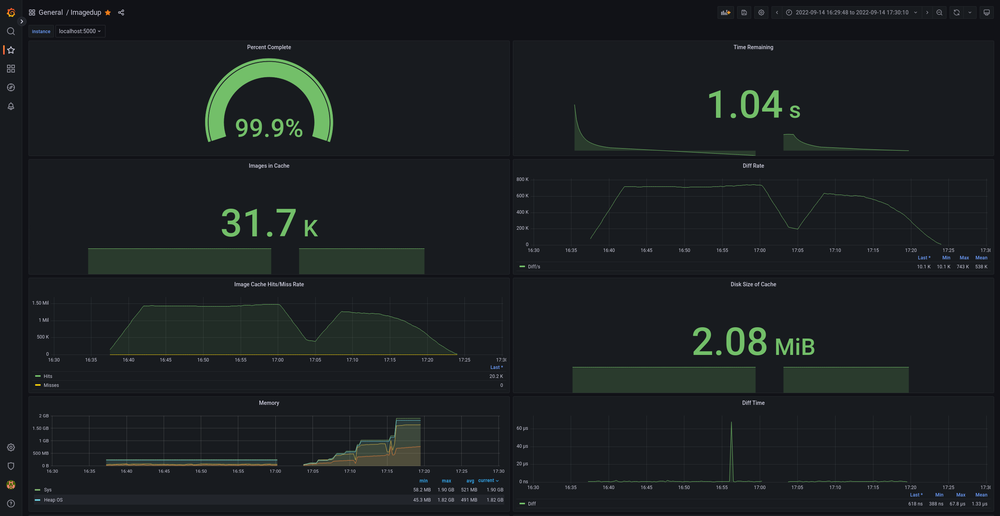

# ImageDup
[](https://github.com/kmulvey/imagedup/actions/workflows/release_build.yml) [](https://codecov.io/gh/kmulvey/imagedup) [](https://goreportcard.com/report/github.com/kmulvey/imagedup) [](https://pkg.go.dev/github.com/kmulvey/imagedup)

Got a lot of images with many duplicates? Maybe of different sizes? `imagedup` uses [perceptual hashing](https://en.wikipedia.org/wiki/Perceptual_hashing) to find images that are close in appearance but not exact. Once `imagedup` is finished the `verify` tool can be used to read the delete log and open images in pairs so you can double check them before they are deleted. This step is necessary as perceptual hashing is not perfect and will sometimes show two completely different images.  A second tool `uniqdirs` can be use with the same options as `verify` and will dedup within directories which are each considered unique. This is helpful with more organized directory layouts.

## Run
```
./nsquared -cache-file cache.json -output-file delete.log -dir /path/to/images -threads 5 -dedup-file-pairs 
# OR
./uniqdirs -cache-file cache.json -output-file delete.log -dir /path/to/images -threads 5 -dedup-file-pairs

# this will create delete.log which will be used by the verify tool.

./verify -delete-file delete.log
```

print help:

`imagedup -h`

## Deduping pairs of images
Deduping is done with a roaring bitmap which will reduce the number of comparisons by half but will increase memory usage. This is a tradeoff you will need to consider. This feature is disabled by default and can be changed by passing `-dedup-file-pairs`.

### Without deduping the pairs
```
INFO[2022-09-15 11:29:32] Found 31722 dirs                             
INFO[2022-09-15 11:29:32] Started, go to grafana to monitor            
INFO[2022-09-15 11:51:34] Shutting down                                
INFO[2022-09-15 11:51:34] Total time taken: 22m2.221316446s   
```

### Deduping the pairs
```
INFO[2022-09-15 11:56:28] Found 31722 dirs                             
INFO[2022-09-15 11:56:28] Started, go to grafana to monitor            
INFO[2022-09-15 12:13:52] Shutting down                                
INFO[2022-09-15 12:13:52] Total time taken: 17m24.991176074s 
```
### Compare Stats
First run is without deduping file pairs, second is with it. 


